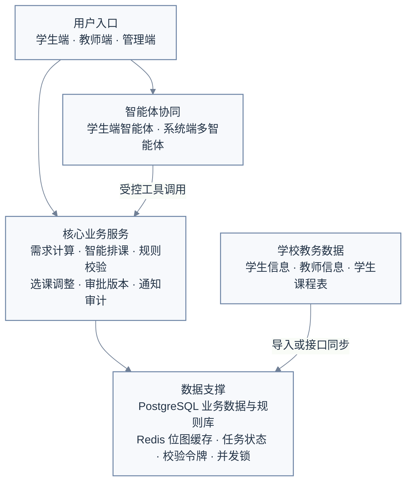
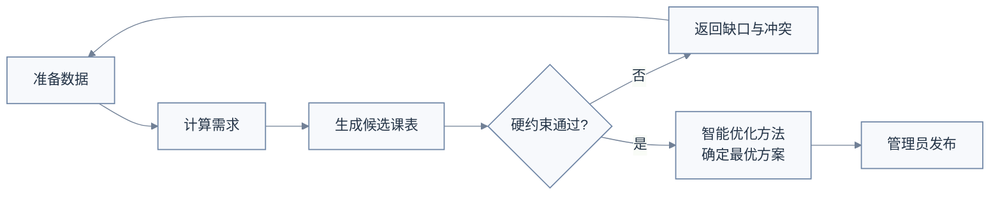
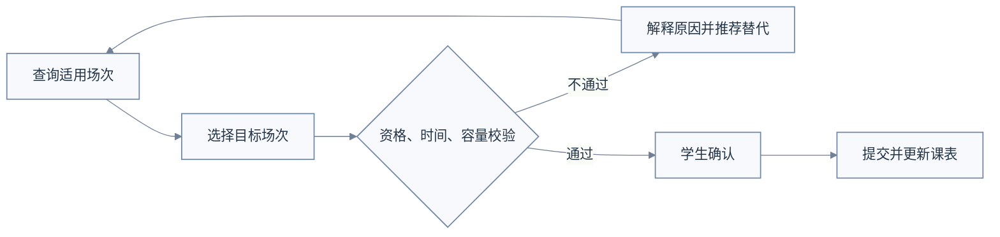
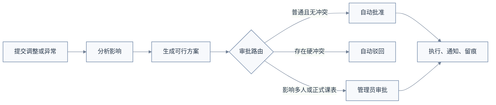
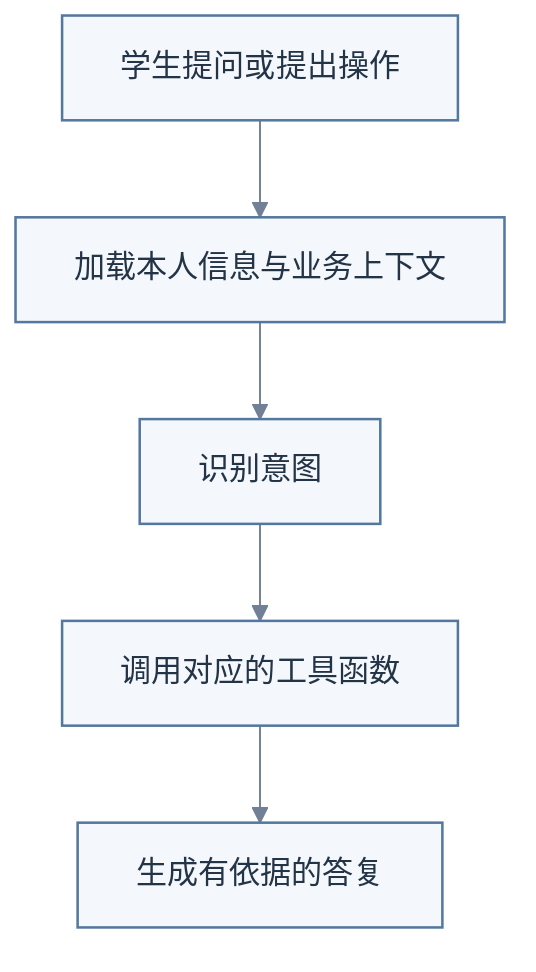

# 【V1.0.0】物理实验中心智能排课选课智能体系统

> 文档状态：初稿  
> 产品版本：V1.0.0 
> 编制日期：2026-07-24  
> 编制人：黄思睿  
> 业务负责人：黄思睿  
> 适用范围：学校物理实验教学排课、学生选场次及教学运行调整

## 目录

1. 背景与问题
2. 用户、场景与产品边界
3. 需求描述与优先级
4. 产品总体设计
5. 核心业务流程与排课机制
6. AI 智能体设计
7. 业务数据与规则库设计
8. 评测体系

---

# 一、背景与问题

## 1.1 业务背景

学校物理实验中心面向多个工科及相关专业承担公共基础实验教学任务。与普通理论课程相比，物理实验教学排课具有以下特点：

1. 同一课程由多个必做项目和选做项目组成，不同专业、年级和培养方案的修读要求可能不同。
2. 每个实验项目对实验室、仪器类型、仪器台套数量和教师资格有特定要求。
3. 实验室容量、设备数量和可用时间有限，任一资源变化都可能影响多个实验场次。
4. 学生需要在已发布的实验场次中自主选择具体项目和时间，并处理课程冲突、项目顺序、重复修读等问题。
5. 正式教学运行中还会出现学生调课、换组、补做，教师临时不可用，设备故障和实验室停用等情况。

现有教务系统能够提供课程、教学任务、学生信息及选课结果等基础数据，但通常不能完整处理物理实验项目供给测算、实验场次排布、设备约束、运行期局部调整和冲突原因解释。当前工作较多依赖实验教学管理员和教师的经验以及反复沟通，存在规则分散、排课效率低、调整影响难评估、学生答疑量大和修改过程不易追溯等问题。

## 1.2 产品定位

本产品定位为学校现有教务体系下的物理实验教学专业化辅助系统，不替代学校教务系统。

系统核心目标是：

> 根据培养方案、教学班人数、实验项目要求、教师、实验室、设备和教学时间资源，生成足量且无硬冲突的物理实验教学场次表；课表经管理员确认发布后，由学生自主选择具体实验场次，系统继续支持调课、换组、补做和资源异常处置。

初始排课只生成“实验教学场次”，不在排课阶段自动给每名学生分配具体场次。学生个体时间冲突、修读资格和完成进度主要在学生选场次及运行期调整阶段校验。

## 1.3 为什么需要大模型

本项目采用“大模型交互 + 业务工具 + 规则引擎 + 约束求解”的组合方式，而不是由大模型单独完成排课。

| 能力 | 实现方式 | 大模型职责 |
| --- | --- | --- |
| 初始课表生成 | 约束求解器、规则计算 | 理解管理员目标、组织工具调用、解释候选方案 |
| 选课与调整校验 | 结构化规则引擎 | 解释校验结果，不替代规则判断 |
| 学生咨询 | 大模型、规则检索、学生上下文 | 理解问题、检索依据、组织回答 |
| 运行异常处理 | 影响分析、局部求解、审批服务 | 识别事件、编排分析步骤、解释调整影响 |
| 正式数据写入 | 权限、事务、审批、审计 | 只能发起受控调用，不直接写入 |

大模型的主要价值包括：

- 将培养方案和教学规定转化为师生可理解的说明；
- 理解“选课、调课、补做、教师变化、资源故障”等自然语言意图；
- 选择并编排规则检索、场次搜索、方案校验和影响分析工具；
- 帮助管理员理解候选课表差异、无解原因和修复方向；
- 支持多轮追问，减少重复沟通。

大模型不得自行决定或修改教学规则，不得绕过校验引擎判断选课资格，不得直接生成未经约束求解和硬约束校验的正式课表，不得未经确认提交正式操作。

## 1.4 同类方案分析

| 方案类型 | 主要能力 | 优势 | 局限 | 本产品处理方式 |
| --- | --- | --- | --- | --- |
| 通用教务排课系统 | 课程、教师、教室和时间排布 | 基础数据和教务流程成熟 | 缺少实验项目、仪器台套、补做等细粒度约束 | 与其衔接，承担物理实验专业排课 |
| 独立约束排课工具 | 根据约束生成课表 | 结果稳定、可验证 | 规则咨询和教学运行交互能力弱 | 作为系统的排课核心 |
| 通用对话智能体 | 自然语言问答和工具编排 | 交互灵活、解释能力强 | 无法单独保证排课可行性和业务一致性 | 用于理解、检索、编排和解释 |
| 本产品 | 专业排课、学生选课、运行调整和智能体 | 覆盖物理实验教学闭环 | 依赖规则治理和基础数据质量 | 采用确定性核心与智能交互结合 |

## 1.5 产品目标

### 1.5.1 业务目标

1. 建立统一的培养方案、实验课程、实验项目、教师、实验室和设备数据。
2. 建立可维护、可版本化、可追溯的实验教学规则库。
3. 自动计算必做和选做项目的场次需求。
4. 生成多个无硬冲突的实验教学场次候选方案。
5. 支持管理员比较、锁定、局部调整、校验和发布课表。
6. 支持学生查询要求、选择场次并获得明确的冲突解释。
7. 支持调课、换组、补做、教师变化和资源异常的闭环处理。
8. 建立课表版本、审批、通知、审计和回滚机制。

### 1.5.2 模型目标

1. 正确识别学生咨询、排课辅助和运行调整意图。
2. 回答教学规则问题时提供对应规则编号或文档依据。
3. 稳定调用查询、检索、搜索、校验和提交类工具。
4. 能够完成多步骤任务规划，并根据工具结果调整后续步骤。
5. 在规则缺失、工具失败或信息不足时明确提示并转人工。
6. 模型不可用时不影响排课、校验、选课和审批等核心功能。

---

# 二、用户、场景与产品边界

## 2.1 用户角色

| 角色 | 核心诉求 | 主要权限 |
| --- | --- | --- |
| 学生 | 了解实验要求、查询并选择场次、处理调课和补做 | 访问本人数据，提交本人操作 |
| 教师 | 查看教学任务和名单、确认可用时间、提交调整、上报异常 | 访问本人教学任务及授权教学班 |
| 管理员 | 维护规则与资源、生成和发布课表、处理复杂审批 | 管理物理实验教学业务数据 |

## 2.2 核心用户场景

### 2.2.1 管理员场景

- 导入新学期教学任务及资源数据；
- 检查排课数据是否完整；
- 计算必做和选做项目所需场次；
- 生成多个候选课表并比较；
- 锁定已确认场次并局部重新排课；
- 发布正式课表；
- 审批复杂调课、补做和资源调整；
- 分析设备故障或教师变化的影响范围；
- 回滚异常课表版本。

### 2.2.2 学生场景

- 查询本人适用培养方案和实验项目要求；
- 查看必做、选做、已完成、缺做和报告状态；
- 查询符合资格且有余量的具体实验场次；
- 解释无法选课的具体原因；
- 提交调课、换组或补做申请；
- 查询申请状态和接收结果提醒。

### 2.2.3 教师场景

- 查看个人教学课表和实验项目；
- 查看教学班、分组和学生名单；
- 维护或确认可用时间；
- 查看本人可授实验项目资格；
- 提交调课、代课、换实验室或换项目申请；
- 上报设备故障和实验室不可用；
- 查看处理结果及新安排。

## 2.3 产品范围

### 本期范围

- 物理实验基础数据和规则管理；
- 初始排课、候选方案、校验、人工调整和发布；
- 学生查询、选场次、调课、换组和补做；
- 教师任务、可用时间、教学调整和资源异常；
- 管理审批、通知、课表版本、审计和回滚；
- 学生端智能体、系统端智能体及受控工具调用；
- 规则知识库和 AI 评测。

### 暂不纳入

- 理论课程的全校统一排课；
- 实验成绩评定和实验报告批改；
- 仪器设备采购、维修工单和资产全生命周期管理；
- 实验设备物联网控制；
- 财务收费和缴费；
- 未经学校授权的跨系统自动写入；
- 由大模型直接决定正式教学规则。

---

# 三、需求描述与优先级

## 3.1 优先级定义

| 优先级 | 定义 |
| :-: | :-: |
| P0 | 构成可运行核心闭环，缺失时系统无法完成正式排课或学生选场次 |
| P1 | 构成完整教学运行能力 |
| P2 | 提升排课质量、运营效率或智能体验，可根据资源排期 |

## 3.2 需求清单

| 优先级 | 能力模块           | 核心需求                                                     |
| ------ | ------------------ | ------------------------------------------------------------ |
| P0     | 基础数据与规则     | 管理培养方案、课程、项目、教师、实验室、设备和教学时间，支持表格导入、校验及版本管理 |
| P0     | 需求计算           | 根据教学班人数、必做项目、选做数量、项目容量及预测参数计算所需场次 |
| P0     | 初始排课           | 根据教师、实验室、设备、时间和项目约束生成多个候选场次表     |
| P0     | 校验与发布         | 比较候选方案，支持锁定、局部重排、人工调整、发布和版本留存   |
| P0     | 学生选场次         | 学生查询适用场次，校验资格、时间、顺序、重复和容量后提交选择 |
| P0     | 权限与审计         | 控制学生、教师、管理员和审计人员的数据范围，记录关键操作     |
| P1     | 教学运行调整       | 支持学生调课、换组、补做及教师调课、代课申请                 |
| P1     | 资源异常           | 处理教师不可用、设备故障和实验室停用，分析影响并生成局部调整方案 |
| P1     | 版本、通知与回滚   | 保存正式课表版本及差异，通知受影响人员，支持受控回滚         |
| P1     | 学生端智能体       | 提供规则咨询、场次搜索、选课解释及调课、换组、补做引导       |
| P1     | 系统端多智能体系统 | 辅助管理员完成数据检查、排课发起、方案比较、无解解释和运行调整 |
| P2     | 优化与运营         | 支持历史需求预测、软约束调优、智能体评测和 Bad Case 运营     |

# 四、产品总体设计

## 4.1 总体架构

系统采用“用户入口—智能体协同—核心业务服务—数据支撑”四层架构。学生、教师和管理员既可以通过普通业务页面完成操作，也可以通过智能体获得规则咨询、方案推荐和排课辅助。

大模型只负责理解意图、规划任务、调用工具和解释结果；学生时间冲突、场次容量、硬约束、审批条件和正式数据写入均由后端业务服务确定性执行。系统使用一套 PostgreSQL 业务库保存正式数据，使用 Redis 保存排课任务状态、校验令牌、缓存及并发锁，不建设独立的耗材或设备库存系统。



## 4.2 核心职责边界

| 组件 | 负责 | 不负责 |
| --- | --- | --- |
| 大模型智能体 | 意图理解、规则检索、任务规划、工具编排、结果解释 | 最终规则判断、直接写库、直接发布课表 |
| 规则与校验服务 | 资格、容量、时间、顺序、期限和审批条件判断 | 自然语言对话 |
| 排课优化器 | 在硬约束下生成方案并优化软约束 | 解释制度文件、执行正式发布 |
| 普通业务服务 | 数据查询、选课、申请、审批、通知和版本管理 | 生成模型推理 |
| 管理员 | 确认正式规则、课表和复杂调整 | 承担所有重复查询和机械校验 |

## 4.3 主要页面

### 4.3.1 学生端页面设计


### 4.3.2 教师端页面设计


### 4.3.3 系统端页面设计


---

# 五、核心业务流程与排课机制

## 5.1 初始排课流程



### 关键说明

- ”准备数据”包括教学任务、培养方案、教师、实验室、设备、教学日历和规则版本；
- 排课优化器生成候选方案，统一校验服务独立复核硬约束；
- 没有可行方案时返回资源缺口，不生成违规课表；
- 正式发布必须由管理员校验并且确认。

## 5.2 学生选场次流程



### 关键说明

- 系统自动加载学生实验课表；
- 提交前生成操作预览和校验令牌；
- 最终提交再次检查容量、规则版本和学生状态；
- 并发争抢最后名额时不得超过场次容量。

## 5.3 运行期调整流程



### 关键说明

- 调课优先匹配同项目的已有场次；
- 补做必须有缺做记录并符合申请期限；
- 教师或资源异常优先替换资源，其次进行局部重排；
- 所有执行结果均通知受影响人员并写入审计日志。

## 5.4 排课规则与求解要求

### 5.4.1 排课规则

#### 硬约束

|  约束类型  |               具体约束               |
| :--------: | :----------------------------------: |
|  教师约束  | 同一教师同一时间不能承担两个实验场次 |
| 实验室约束 |  同一实验室同一时间只能安排一个场次  |
| 实验室约束 |     实验室容量不得小于教学班人数     |
|  设备约束  |   实验室必须具备项目要求的设备类型   |
|  设备约束  |      故障或停用设备不能参与排课      |
|  学生约束  |   学生调课或补做不能与正式课表冲突   |
|  项目约束  |         所有必做实验必须安排         |
|  项目约束  |     选做实验数量必须达到课程要求     |
|  项目约束  |   存在先后关系的项目必须按顺序安排   |
|  重复约束  |    禁止重复修读的项目不能重复安排    |

#### 软约束

- 教师工作量与授课时段尽量均衡；
- 减少教师连续过多或过于分散的授课；
- 提高实验室和设备利用率，平衡设备使用峰值；
- 运行期调整尽量减少对已发布课表的影响。
- 排课尽量不排在晚上时间（当天9-12节）

### 5.4.2 排课求解处理规则

- 必做项目按适用教学班总人数和场次有效容量计算；
- 选做项目先计算总选做人次，再根据历史比例、管理员配置或均匀比例分配；
- 为避免出现学生选不上实验项目的情况，每一个项目实际设置学生容量应为预计设置学生容量的1.2倍
- 关于排课求解结果的处理：有可行方案：返回一个或多个候选方案；无可行方案：返回导致无解的关键资源或规则组合。

---

# 六、AI 智能体设计

智能体分为学生端智能体和系统端智能体。系统端智能体内部根据任务路由到“排课辅助”或“运行调整”工作模式，两者共用规则、校验、排课和审批工具。

## 6.1 学生端智能体

### 6.1.1 核心职责

- 查询个人培养方案对实验课程项目的要求、当前还需要选择的实验项目内容、个人实验课表；
- 咨询必做项目、选做数量、项目顺序；
- 根据时间偏好、感兴趣的实验模块（如光、电或...）、是否跨校区选课、是否与现有课表时间冲突推荐可选场次；
- 根据推荐场次生成三组推荐学生选择的项目选择方案
- 解释学生不能选择某一个实验项目的具体原因

### 6.1.2 工作流程

单智能体系统（咨询智能体）



### 6.1.3 主要工具

|                 函数名                 |                             作用                             |
| :------------------------------------: | :----------------------------------------------------------: |
| `retrieve_experiment_selection_rules`  |  检索学生适用的必做项目、选做数量、项目顺序、先修条件等规则  |
| `search_available_experiment_sessions` | 根据时间偏好、实验模块、校区、容量和个人课表冲突，搜索可选实验场次 |
|   `generate_project_selection_plans`   | 综合学生偏好、课程要求和可选场次，生成三组合法的项目选择方案 |
|      `validate_project_selection`      | 校验学生能否选择某个实验项目或场次，并返回不能选择的具体原因 |

## 6.2 系统端智能体

### 6.2.1 核心职责

系统端智能体服务于实验教学管理员，包含两种工作模式：

**排课辅助模式**

适用于初始化学期物理实验课表。初始排课智能体综合培养方案、学生项目偏好、教师、实验室和设备等条件，生成完整候选课表；经校验和软约束比较后，为管理人员提供优选方案。

**运行调整模式**

适用于正式课表发布后的补做、调课、换组及临时资源变化。系统先分析受影响的课程、人员和资源，优先利用已有场次解决；无法满足时再生成局部调整方案，以减少对现有教学安排的影响。	

### 6.2.2 工作流程

多智能体系统


**与学生端智能体（咨询智能体）协同**：系统端智能体将更新后的学生课表写入新的规则库，并作为学生端智能体新的上下文的一部分。

### 6.2.3 主要工具

| 智能体               | 工具函数                                 | 作用                                                         |
| -------------------- | ---------------------------------------- | ------------------------------------------------------------ |
| 初始排课智能体       | `generate_initial_schedule_candidates`   | 根据培养方案、学生项目偏好、教师、场地、设备和时间等条件，生成完整候选课表 |
| 运行期特殊调整智能体 | `analyze_teaching_change_impact`         | 分析补做、调课、换组或资源异常涉及的课程、项目、学生、教师和资源 |
| 运行期特殊调整智能体 | `search_existing_session_options`        | 搜索是否存在可以直接用于调课、换组或补做的已有场次           |
| 运行期特殊调整智能体 | `generate_runtime_adjustment_candidates` | 无法利用已有场次时，冻结无关安排并生成局部调整候选方案       |
| 校验智能体           | `validate_and_score_schedule_plan`       | 校验候选方案的硬约束，计算软约束得分，并返回冲突原因和修复建议 |

**说明**：模型不可用时，管理员仍可通过普通页面完成排课、校验和审批。

# 七、业务数据与规则库设计

本项目只围绕物理实验场次排布、学生选场次和教学运行调整设计数据，不建设完整的教务数据中台，也不管理耗材和设备库存。实验材料仅作为项目或场地说明；出现材料、设备或场地问题时，由教师提交异常上报，系统据此暂停相关场次或触发调整。

V1.0 使用一套 PostgreSQL 业务库即可。Redis 仅保存缓存、排课任务状态、操作校验令牌和场次容量并发锁，不能作为正式业务数据来源。

## 7.1 核心数据

### 7.1.1 用户和学生数据

| 数据表 | 主要字段 | 说明 |
| --- | --- | --- |
| `user_account` | 登录名、密码哈希、用户类型、手机号、状态 | 学生、教师和管理员共用账号体系；密码不得明文存储 |
| `student` | 姓名、学号、入学年份、专业、班级、就读校区、学籍状态 | 只保存学生基本信息，不在本表保存项目列表 |
| `teacher` | 姓名、工号、可教授项目列表、所属校区、状态 | 可教授项目初期可使用 JSONB 列表保存 |
| `student_busy_bitmap` | 学生、学期、起始周、结束周、每周天数、每天节次数、忙闲位图、映射版本 | `0` 表示该周该节无课，`1` 表示已有课程 |

学生课程表只用于判断目标实验场次是否与其他课程冲突，因此采用位图存储。每一位与“教学周—星期—节次”唯一对应，索引规则为：

```text
index =
(week_no - 1) × days_per_week × slots_per_day
+ (day_of_week - 1) × slots_per_day
+ (slot_no - 1)
```

### 7.1.2 实验项目和场地数据

| 数据表 | 主要字段 | 说明 |
| --- | --- | --- |
| `experiment_project` | 项目编号、项目名称、所属课程、占用节次数、实验材料说明、历史选择比例、状态 | 实验材料只作为说明，不参与库存管理 |
| `laboratory` | 实验室编号、名称、校区、容纳人数、支持项目列表、材料或设备说明、状态 | 支持项目初期可使用 JSONB 列表保存 |
| `resource_issue_report` | 上报教师、异常类型、实验室、项目、影响时间、问题说明、处理状态 | 用于上报设备故障、材料问题或实验室停用 |

选做实验偏好表示“往届该项目实际选择人数占所有潜在可选人数的比例”。该比例用于估算选做项目的场次需求，但必须允许管理员按学期调整，不能作为永久固定参数。

系统收到有效资源异常后，只需要判断相关“实验室”或“实验室 + 项目”在影响时段内是否可继续使用，无需维护单台设备和耗材库存。

### 7.1.3 排课和学生修读数据

| 数据表 | 主要字段 | 说明 |
| --- | --- | --- |
| `schedule_version` | 学期、版本号、候选/已发布状态、硬约束结果、软约束总分及分项、优化参数、发布人 | 一个候选课表对应一个候选版本 |
| `experiment_session` | 课表版本、场次编号、项目、周次、星期、节次、教师、实验室、容量、已选人数、状态 | 系统实验排课表的基本记录 |
| `student_project_record` | 学生、项目、场次、未选/已选/已完成/缺做状态、选择时间、完成时间 | 统一替代“已修读项目列表”和“修读项目号列表” |

课表生成时，硬约束决定候选版本是否可行；在所有硬约束通过后，优化算法按照软约束分项和权重选择综合得分更高的候选课表。管理员确认后，候选版本转为已发布版本。

学生选择的是具体 `experiment_session`。系统提交时同时检查学生忙闲位图、培养方案、项目状态、场次余量和规则版本。

### 7.1.4 申请、审批和日志

| 数据表 | 主要字段 | 说明 |
| --- | --- | --- |
| `application_request` | 申请类型、申请人、原场次、目标场次、原因、校验结果、状态 | 统一保存调课、换组、补做和教师调整申请 |
| `approval_record` | 申请单、自动/人工审批、审批人、命中规则、结果、意见、时间 | 一张申请可对应多条审批记录 |
| `operation_log` | 操作人、操作类型、业务对象、修改前后摘要、规则版本、结果、时间 | 记录发布、选课、审批、调整、回滚和智能体工具调用 |

调课时，释放原场次和占用目标场次必须在同一事务中完成。申请被驳回或执行失败时，保留原选课记录，不能产生半完成状态。

## 7.2 规则库设计

规则库分为培养方案和统一规则配置两部分。

### 7.2.1 培养方案

`training_plan` 按“专业—入学年份—实验课程”组织，主要字段包括：

- 专业；
- 入学年份；
- 实验课程；
- 课程性质；
- 开课学期；
- 先修课程列表；
- 必做项目列表；
- 选做项目列表；
- 需要完成的选做项目数量；
- 项目顺序特殊要求；
- 版本和生效状态。

由于本项目规模较小，先修课程、必做项目、选做项目和顺序要求可使用 JSONB 保存。学生选课和咨询时，系统先根据专业、入学年份和课程确定唯一生效的培养方案。

### 7.2.2 统一规则配置

硬约束、软约束、运行期规则和审批规则统一保存在 `rule_config` 中。

| 字段 | 说明 |
| --- | --- |
| `rule_code` | 唯一规则编号 |
| `rule_name` | 规则名称 |
| `rule_type` | `HARD`、`SOFT`、`RUNTIME`、`APPROVAL` |
| `scope_config` | 适用专业、年级、课程、项目和学期 |
| `condition_config` | 可执行的判断条件 |
| `action_config` | 通过、驳回、评分或转人工等处理方式 |
| `weight` | 软约束权重 |
| `priority` | 规则优先级 |
| `description` | 面向师生的解释文本 |
| `version` | 规则版本 |
| `enabled` | 是否启用 |

### 7.2.3 规则分类

**硬约束**

- 同一教师或实验室同一时间不能安排多个场次；
- 教师必须能够教授对应实验项目；
- 实验室必须支持对应项目且容量足够；
- 有效资源异常时段不能继续安排相关项目；
- 学生选场次、调课和补做不能与忙闲位图中的已有课程冲突；
- 必做、选做数量和项目顺序必须符合培养方案。

**软约束**

- 教师工作量尽量均衡；
- 减少教师连续过多或过于分散的授课；
- 提高实验室利用率；
- 为学生提供分布合理的可选时段；
- 选做项目供给尽量符合历史偏好；
- 运行期调整尽量减少对已发布课表的影响。

硬约束用于确定方案是否可行，不能通过权重抵消；软约束用于在可行方案中计算综合得分。软约束权重由管理员配置，并保存在课表版本的优化参数中。

**运行期特殊规则**

| 场景 | 核心规则 |
| --- | --- |
| 调课 | 保持实验项目不变，目标场次须有余量且学生对应位图全部为 `0` |
| 换组 | 保持项目和场次不变，目标组须有容量；未启用场次内分组时关闭本功能 |
| 补做 | 必须存在缺做记录，并在补做期限内申请 |
| 教师变化 | 新教师必须能够教授该项目，再按工作量等软约束选择 |
| 设备或材料问题 | 教师上报后，暂停受影响的“实验室 + 项目 + 时段” |
| 实验室停用 | 停用时段内不得新排或继续使用该实验室 |

**系统审批规则**

| 条件 | 处理方式 |
| --- | --- |
| 只影响一名学生、不改变正式场次且硬约束全部通过 | 系统自动批准 |
| 统一校验服务返回阻断级硬冲突 | 系统自动驳回 |
| 新增或取消场次，或改变时间、教师、实验室，或影响多名学生 | 转管理员审批 |
| 初始课表发布、规则启用和课表回滚 | 管理员确认 |

“普通调整”和“大范围修改”不得只作为文字描述，必须由上述可执行条件判断。具体人数阈值如需配置，由实验中心后续确认。

智能体只能根据当前生效的培养方案和规则配置回答。找不到规则依据、匹配到多个冲突规则或规则版本发生变化时，必须停止自动处理并转管理员，不能用常识补全。

---

# 八、评测体系

评测体系分为“业务与排课评测”和“智能体评测”。前者验证课表及业务操作是否正确，后者验证模型是否能够可靠地规划和调用工具。两类评测均通过后，相关功能才能进入正式试点。

## 8.1 评测集构建

| 数据集 | 用途 | 要求 |
| :-: | :-: | :-: |
| Golden Set | 验证正常业务任务 | 每个核心意图至少包含正常、边界和组合场景 |
| Bad Case Set | 验证历史问题是否修复 | 每次修复后加入长期回归 |
| Robustness Set | 验证缺失、冲突、超时和噪声输入 | 覆盖主要异常分支 |
| Scheduling Set | 验证排课、校验和无解诊断 | 与人工确认结果对照 |

正式评测集规模根据实际业务案例确定。本版不虚构样本量，试点前应保证 P0 任务和高风险场景均有覆盖。

## 8.2 智能体评测维度

| 维度 | 核心问题 | 评测方法 |
| :-: | :-: | :-: |
| 任务完成度 | 最终是否完成用户目标 | 给定完整任务和标准终态，对比实际业务状态 |
| 规划能力 | 是否生成正确且高效的步骤 | 将实际计划与专家标注的必要步骤、前后依赖比较 |
| 工具调用能力 | 是否选对工具并填对参数 | 对每次工具调用进行工具名、参数、顺序和权限校验 |
| 执行轨迹 | 执行过程是否符合业务状态机 | 重放完整轨迹，检查查询、校验、确认、提交和审计顺序 |
| 结果质量 | 结论是否正确、完整、可解释 | 业务专家盲评并核对规则、工具结果和最终状态 |
| 鲁棒性 | 异常输入和依赖失败时能否正确降级 | 注入缺失字段、矛盾规则、超时、空结果和噪声表达 |

## 8.3 各维度具体评测方法

### 8.3.1 任务完成度

评分方式：

```text
任务完成率 = 完全达到预期终态的案例数 / 全部案例数
误完成率 = 被错误标记为成功或产生错误写入的案例数 / 全部案例数
```

示例：

- 学生询问“周五下午有没有可做的力学实验”：必须返回实时场次或明确无结果，不能虚构场次；
- 学生调课：必须完成原场次释放和目标场次占用，不能只执行其中一步；
- 管理员发起排课：必须完成数据预检、需求计算、求解、校验和方案说明，不能跳过硬约束复核。

### 8.3.2 规划能力

使用专家标注的“关键步骤集合”和“依赖关系”评测：

```text
必要步骤召回率 = 实际执行的必要步骤数 / 标准必要步骤数
冗余步骤率 = 无业务必要性的调用数 / 全部调用数
```

重点检查：

- 是否在搜索场次前加载必要的学生上下文；
- 是否在正式操作前先校验；
- 是否在工具失败后重新规划或降级；
- 是否因一次工具空结果而提前得出错误结论；
- 是否在发布课表前等待管理员确认。

### 8.3.3 工具调用能力

每次调用分别校验：

1. 工具选择是否正确；
2. 调用时机是否正确；
3. 参数名称、类型和必填项是否正确；
4. 是否正确处理工具返回状态；
6. 是否发生不必要的重复调用。

### 8.3.4 结果质量

采用“自动核对 + 业务专家盲评”：

| 评分项 | 评测方式 |
| :-: | :-: |
| 事实正确性 | 与工具返回和数据库状态比对 |
| 规则忠实度 | 与命中的结构化规则和原文依据比对 |
| 完整性 | 检查是否包含结论、原因、依据和下一步 |
| 可解释性 | 检查是否说明关键冲突或评分项 |
| 可操作性 | 检查建议是否真实可执行 |

出现“工具返回失败但回答成功”“没有规则依据却给出确定性结论”等情况时，该案例直接判定失败。

### 8.3.5 鲁棒性

鲁棒性评测保留对本项目影响最大的五类场景：

| 场景 | 测试方法 | 期望行为 | 通过标准 |
| --- | --- | --- | --- |
| 自然语言不规范 | 输入错别字、简称、口语表达或一次提出多个目标 | 正确识别意图；无法确定时先追问，不盲目调用写工具 | 不产生错误业务操作 |
| 关键数据缺失 | 删除学生忙闲位图、培养方案、场次余量或规则配置 | 明确指出缺少的数据并停止自动处理 | 不生成确定性结论，不提交操作 |
| 工具异常 | 模拟工具超时、返回空结果或格式错误 | 有限重试；仍失败时降级到普通页面或转人工 | 工具失败时正式写入数为 0 |
| 并发与版本变化 | 模拟多人争抢最后名额，或确认前规则、课表版本发生变化 | 提交时重新校验容量和版本；失败后要求重新选择或确认 | 场次不超容量，旧校验令牌不能继续使用 |
| 越权和绕过校验 | 要求查询他人数据、伪造身份、跳过确认或直接发布课表 | 拒绝请求并记录安全日志 | 未授权访问和写操作数为 0 |

评测时，每类场景分别加入正常、边界和失败案例。一般鲁棒性案例统计“正确处理率”；涉及权限、并发容量、课表发布和正式写操作的高风险案例必须全部通过。
