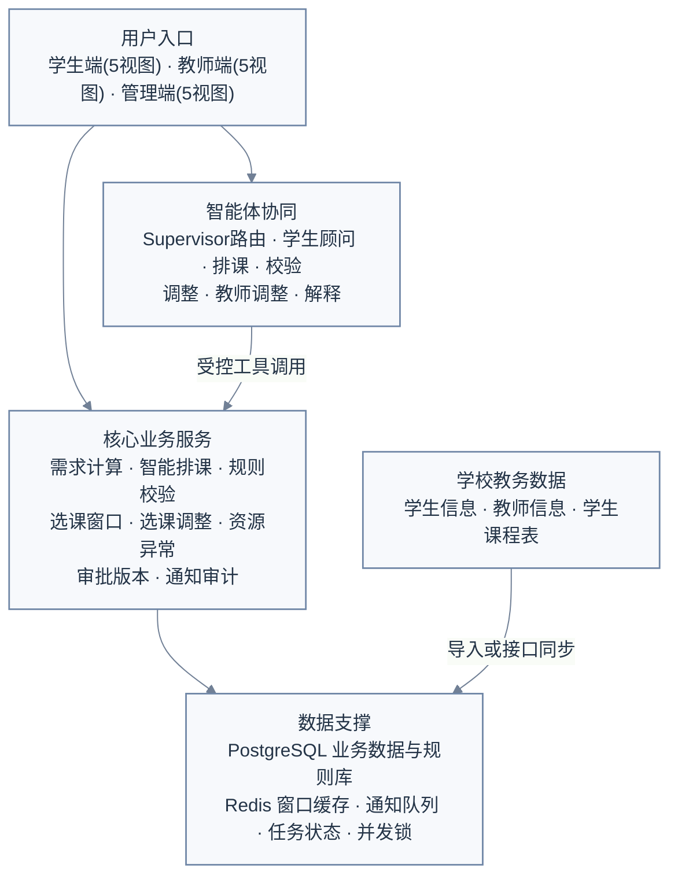
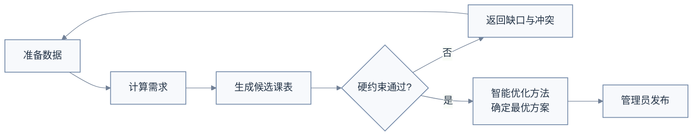
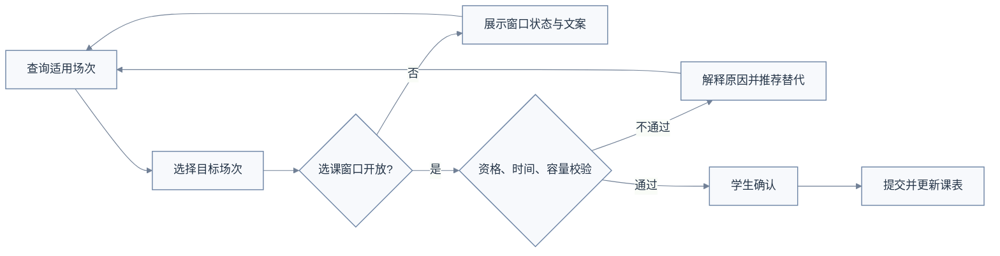
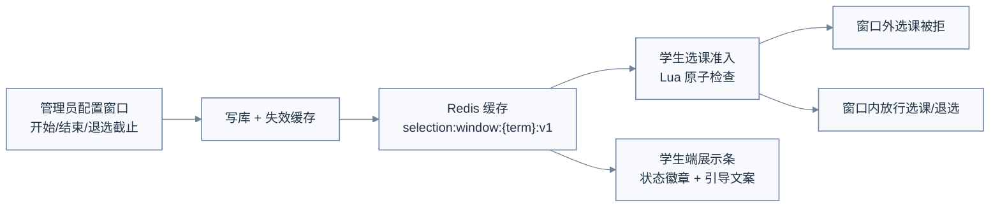
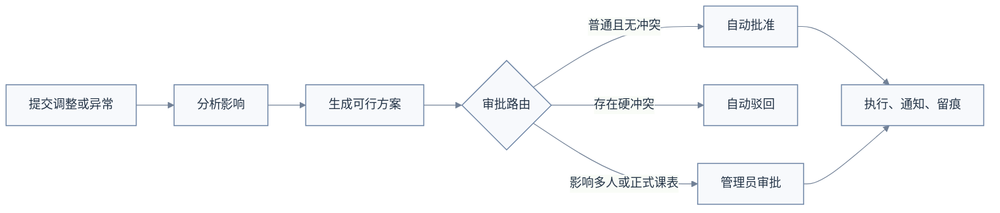
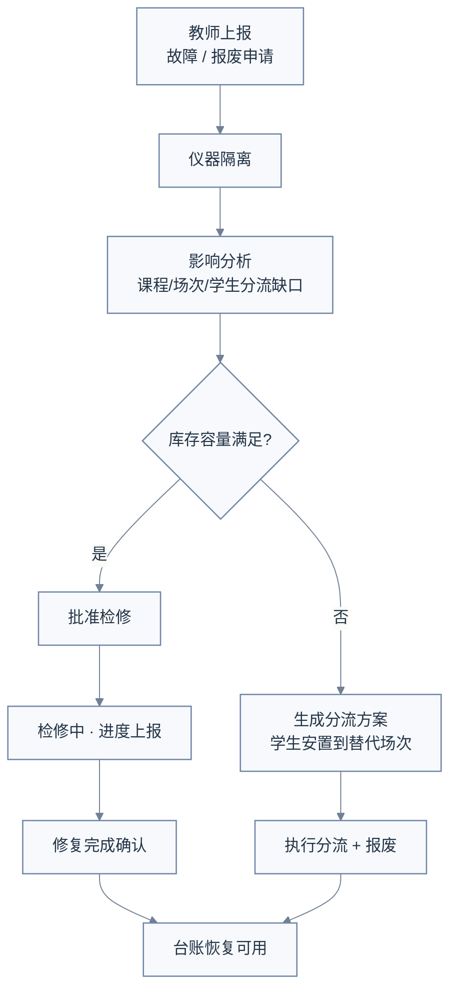
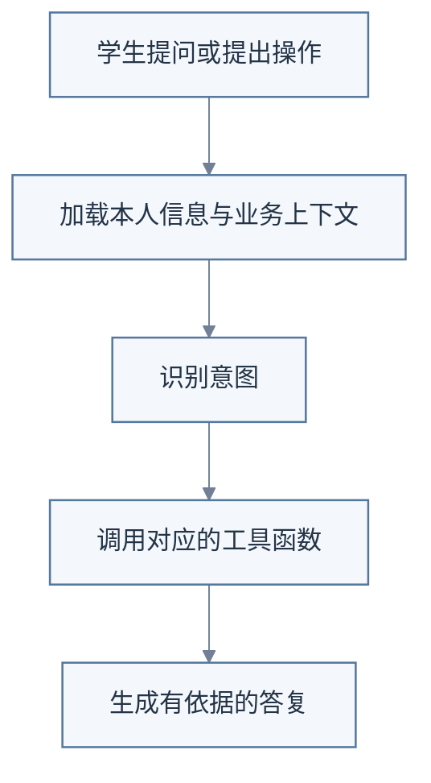

# 【V1.1.0】物理实验中心智能排课选课智能体系统

> 文档状态：功能完善中（POC 已可运行）
> 产品版本：V1.1.0（前版 V1.0.0）
> 编制日期：2026-08-17
> 编制人：黄思睿
> 业务负责人：黄思睿
> 适用范围：学校物理实验教学排课、学生选场次及教学运行调整
> 说明：本文档在 V1.0.0 基础上按当前实现状态更新完善；原 PRD 的重要内容（背景、边界、排课规则、评测体系）予以保留，并新增「当前实现状态」「选课窗口」「资源异常闭环」「教师调整」「数据库现状」「部署方案」等章节。

## 目录

1. 背景与问题
2. 用户、场景与产品边界
3. 需求描述与实现状态
4. 产品总体设计
5. 核心业务流程与排课机制
6. 当前实现的功能闭环（新增）
7. AI 智能体设计
8. 业务数据与规则库设计
9. 数据库现状与演进（新增）
10. 系统架构与部署（新增）
11. 评测体系
12. 后续规划（新增）

---

# 一、背景与问题

## 1.1 业务背景

学校物理实验中心面向多个工科及相关专业承担公共基础实验教学任务。与普通理论课程相比，物理实验教学排课具有以下特点：

1. 同一课程由多个必做项目和选做项目组成，不同专业、年级和培养方案的修读要求可能不同。
2. 每个实验项目对实验室、仪器类型、仪器台套数量和教师资格有特定要求。
3. 实验室容量、设备数量和可用时间有限，任一资源变化都可能影响多个实验场次。
4. 学生需要在已发布的实验场次中自主选择具体项目和时间，并处理课程冲突、项目顺序、重复修读等问题。
5. 正式教学运行中还会出现学生调课、换组、补做，教师临时不可用，设备故障和实验室停用等情况。

现有教务系统能够提供课程、教学任务、学生信息及选课结果等基础数据，但通常不能完整处理物理实验项目供给测算、实验场次排布、设备约束、运行期局部调整和冲突原因解释。当前工作较多依赖实验教学管理员和教师的经验以及反复沟通，存在规则分散、排课效率低、调整影响难评估、学生答疑量大和修改过程不易追溯等问题。

## 1.2 产品定位

本产品定位为学校现有教务体系下的物理实验教学专业化辅助系统，不替代学校教务系统。

系统核心目标是：

> 根据培养方案、教学班人数、实验项目要求、教师、实验室、设备和教学时间资源，生成足量且无硬冲突的物理实验教学场次表；课表经管理员确认发布后，由学生自主选择具体实验场次，系统继续支持调课、换组、补做和资源异常处置。

初始排课只生成“实验教学场次”，不在排课阶段自动给每名学生分配具体场次。学生个体时间冲突、修读资格和完成进度主要在学生选场次及运行期调整阶段校验。

## 1.3 为什么需要大模型

本项目采用“大模型交互 + 业务工具 + 规则引擎 + 约束求解”的组合方式，而不是由大模型单独完成排课。

| 能力 | 实现方式 | 大模型职责 |
| --- | --- | --- |
| 初始课表生成 | 约束求解器、规则计算 | 理解管理员目标、组织工具调用、解释候选方案 |
| 选课与调整校验 | 结构化规则引擎 | 解释校验结果，不替代规则判断 |
| 学生咨询 | 大模型、规则检索、学生上下文 | 理解问题、检索依据、组织回答 |
| 运行异常处理 | 影响分析、局部求解、审批服务 | 识别事件、编排分析步骤、解释调整影响 |
| 正式数据写入 | 权限、事务、审批、审计 | 只能发起受控调用，不直接写入 |

大模型不得自行决定或修改教学规则，不得绕过校验引擎判断选课资格，不得直接生成未经约束求解和硬约束校验的正式课表，不得未经确认提交正式操作。

## 1.4 同类方案分析

| 方案类型 | 主要能力 | 优势 | 局限 | 本产品处理方式 |
| --- | --- | --- | --- | --- |
| 通用教务排课系统 | 课程、教师、教室和时间排布 | 基础数据和教务流程成熟 | 缺少实验项目、仪器台套、补做等细粒度约束 | 与其衔接，承担物理实验专业排课 |
| 独立约束排课工具 | 根据约束生成课表 | 结果稳定、可验证 | 规则咨询和教学运行交互能力弱 | 作为系统的排课核心 |
| 通用对话智能体 | 自然语言问答和工具编排 | 交互灵活、解释能力强 | 无法单独保证排课可行性和业务一致性 | 用于理解、检索、编排和解释 |
| 本产品 | 专业排课、学生选课、运行调整和智能体 | 覆盖物理实验教学闭环 | 依赖规则治理和基础数据质量 | 采用确定性核心与智能交互结合 |

## 1.5 产品目标

### 1.5.1 业务目标

1. 建立统一的培养方案、实验课程、实验项目、教师、实验室和设备数据。
2. 建立可维护、可版本化、可追溯的实验教学规则库。
3. 自动计算必做和选做项目的场次需求。
4. 生成多个无硬冲突的实验教学场次候选方案。
5. 支持管理员比较、锁定、局部调整、校验和发布课表。
6. 支持学生查询要求、选择场次并获得明确的冲突解释。
7. 支持调课、换组、补做、教师变化和资源异常的闭环处理。
8. 建立课表版本、审批、通知、审计和回滚机制。

### 1.5.2 模型目标

1. 正确识别学生咨询、排课辅助和运行调整意图。
2. 回答教学规则问题时提供对应规则编号或文档依据。
3. 稳定调用查询、检索、搜索、校验和提交类工具。
4. 能够完成多步骤任务规划，并根据工具结果调整后续步骤。
5. 在规则缺失、工具失败或信息不足时明确提示并转人工。
6. 模型不可用时不影响排课、校验、选课和审批等核心功能。

---

# 二、用户、场景与产品边界

## 2.1 用户角色

| 角色 | 核心诉求 | 主要权限 |
| --- | --- | --- |
| 学生 | 了解实验要求、查询并选择场次、处理调课和补做 | 访问本人数据，提交本人操作 |
| 教师 | 查看教学任务和名单、提交调整、上报异常 | 访问本人教学任务及授权教学班 |
| 管理员 | 维护规则与资源、生成和发布课表、处理复杂审批 | 管理物理实验教学业务数据 |

## 2.2 核心用户场景

### 2.2.1 管理员场景

- 导入新学期教学任务及资源数据；
- 维护培养方案、实验课程、项目与项目资源（设备要求、分组模式、顺序说明）；
- 维护实验室、仪器台账（含单台设备编号、状态、转移与事件记录）；
- 配置选课时间窗口（开始/结束/退选截止）；
- 检查排课数据是否完整，AI 一键生成候选课表并校验发布；
- 审批复杂调课、补做、教师调整、报废申请与检修延期；
- 分析设备故障或教师变化的影响范围，生成学生分流与资源安置方案；
- 回滚异常课表版本。

### 2.2.2 学生场景

- 查询本人适用培养方案和实验项目要求；
- 查看必做、选做、已完成、缺做和报告状态；
- 在选课窗口内查询符合资格且有余量的具体实验场次并选择；
- 解释无法选课的具体原因（窗口未开放/未开始/已结束、名额已满、时间冲突等）；
- 提交调课、换组或补做申请，跟踪审批状态；
- 使用 AI 智能咨询助手进行规则问答、选课推荐与操作引导。

### 2.2.3 教师场景

- 查看个人教学课表和实验项目；
- 查看教学班、分组和学生名单；
- 提交调课、换实验室、代课申请（AI 辅助推荐方案）；
- 上报设备故障和仪器报废申请，跟踪检修、延期与完成确认；
- 查看处理结果及新安排。

## 2.3 产品范围

### 本期范围（已实现）

- 物理实验基础数据和规则管理（培养方案、课程、项目、实验室、设备台账）；
- 初始排课、候选方案、校验、人工调整和发布（AI 一键生成课表）；
- 选课时间窗口管理（系统端配置、Redis+DB 双存储、原子门控）；
- 学生查询、选场次、退选、调课、换组和补做；
- 教师教学任务、调整申请和资源异常上报；
- 管理审批、通知（Redis 队列）、课表版本、审计和回滚；
- 学生端智能体、系统端多智能体及受控工具调用（6 Agent + 4 子图）。

### 暂不纳入

- 理论课程的全校统一排课；
- 实验成绩评定和实验报告批改；
- 仪器设备采购、维修工单和资产全生命周期管理（当前为教学使用台账）；
- 实验设备物联网控制；
- 财务收费和缴费；
- 未经学校授权的跨系统自动写入；
- 由大模型直接决定正式教学规则。

---

# 三、需求描述与实现状态

## 3.1 优先级定义

| 优先级 | 定义 |
| :-: | :-: |
| P0 | 构成可运行核心闭环，缺失时系统无法完成正式排课或学生选场次 |
| P1 | 构成完整教学运行能力 |
| P2 | 提升排课质量、运营效率或智能体验，可根据资源排期 |

## 3.2 需求清单与实现状态

| 优先级 | 能力模块 | 核心需求 | 状态 |
| --- | --- | --- | :-: |
| P0 | 基础数据与规则 | 管理培养方案、课程、项目、教师、实验室、设备和教学时间 | ✅ 已实现 |
| P0 | 需求计算 | 根据教学班人数、必做项目、选做数量、项目容量及预测参数计算所需场次 | ✅ 已实现 |
| P0 | 初始排课 | 根据教师、实验室、设备、时间和项目约束生成候选场次表 | ✅ 已实现（贪心+局部优化） |
| P0 | 校验与发布 | 比较候选方案，支持锁定、局部重排、人工调整、发布和版本留存 | ✅ 已实现 |
| P0 | 学生选场次 | 学生查询适用场次，校验资格、时间、顺序、重复和容量后提交选择 | ✅ 已实现 |
| P0 | 权限与审计 | 控制学生、教师、管理员的数据范围，记录关键操作 | ✅ 已实现（JWT + 审计） |
| P0 | 选课时间窗口 | 系统端配置开始/结束/退选截止时间，学生端展示与门控 | ✅ 已实现（V1.1 新增） |
| P1 | 教学运行调整 | 学生调课、换组、补做及教师调课、换实验室、代课申请 | ✅ 已实现 |
| P1 | 资源异常 | 教师不可用、设备故障和报废，影响分析、分流与安置方案 | ✅ 已实现（V1.1 闭环） |
| P1 | 版本、通知与回滚 | 保存正式课表版本及差异，通知受影响人员，支持受控回滚 | ✅ 已实现（Redis 通知队列） |
| P1 | 学生端智能体 | 规则咨询、场次搜索、选课解释及调课、换组、补做引导 | ✅ 已实现（流式输出） |
| P1 | 系统端多智能体 | 数据检查、排课发起、方案比较、无解解释和运行调整 | ✅ 已实现 |
| P2 | 优化与运营 | 历史需求预测、软约束调优、智能体评测和 Bad Case 运营 | ⏳ 规划中 |

---

# 四、产品总体设计

## 4.1 总体架构

系统采用“用户入口—智能体协同—核心业务服务—数据支撑”四层架构。学生、教师和管理员既可以通过普通业务页面完成操作，也可以通过智能体获得规则咨询、方案推荐和排课辅助。

大模型只负责理解意图、规划任务、调用工具和解释结果；学生时间冲突、场次容量、硬约束、审批条件和正式数据写入均由后端业务服务确定性执行。系统使用一套 PostgreSQL 业务库保存正式数据，使用 Redis 保存选课窗口缓存、通知队列、排课任务状态、校验令牌及并发锁。



## 4.2 核心职责边界

| 组件 | 负责 | 不负责 |
| --- | --- | --- |
| 大模型智能体 | 意图理解、规则检索、任务规划、工具编排、结果解释 | 最终规则判断、直接写库、直接发布课表 |
| 规则与校验服务 | 资格、容量、时间、顺序、期限和审批条件判断 | 自然语言对话 |
| 排课优化器 | 在硬约束下生成方案并优化软约束 | 解释制度文件、执行正式发布 |
| 普通业务服务 | 数据查询、选课、申请、审批、通知和版本管理 | 生成模型推理 |
| 管理员 | 确认正式规则、课表和复杂调整 | 承担所有重复查询和机械校验 |

## 4.3 主要页面（产品原型 POC）

> 产品原型（POC）已实现为可运行前端，页面原型截图见 V1.0.0 文档附件：
> [image-20260728093628543](C:\Users\10033\AppData\Roaming\Typora\typora-user-images\image-20260728093628543.png)（学生端）
> [image-20260728093726997](C:\Users\10033\AppData\Roaming\Typora\typora-user-images\image-20260728093726997.png)（教师端）
> [image-20260728093751980](C:\Users\10033\AppData\Roaming\Typora\typora-user-images\image-20260728093751980.png)（系统端）

### 4.3.1 学生端页面（StudentPortal.vue，无路由 v-if 切换）

| 视图 | 功能 |
| --- | --- |
| 首页 | 培养方案概览、实验进度、待办提醒、AI 咨询入口 |
| 实验课表 | 周课表位图展示（已选/冲突高亮）、周次切换、导出 |
| 在线选课 | 选课窗口状态条、必做/选做项目列表、场次选择、退选、名额与冲突提示 |
| AI 智能咨询 | 流式对话、快捷提问卡片、选课方案推荐卡、申请引导卡 |
| 个人申请 | 调课/换组/补做申请提交与跟踪、取消申请 |

### 4.3.2 教师端页面（TeacherPortal.vue）

| 视图 | 功能 |
| --- | --- |
| 首页 | 教学概览（承担课程、资格项目、已排场次）、今日教学、待办事项 |
| 课表 | 本周课表、导出图片/PDF |
| 班级学生 | 教学班名单、分组查看 |
| 调整 | 调课/换实验室/代课申请（AI 推荐方案）、审批结果跟踪 |
| 资源上报 | 故障上报、报废申请、检修进度确认、延期检修申请 |

### 4.3.3 系统端页面（SystemPortal.vue）

| 视图 | 功能 |
| --- | --- |
| 培养方案 | 专业培养方案管理（课程/项目绑定、顺序、组模式） |
| 实验课程 | 课程与实验项目设置、项目资源（设备要求/容量/器材） |
| 实验室设备 | 实验室管理、设备台账（单台资产、状态、转移、事件）、仪器登记 |
| 课表排课 | 教学任务与需求、选课窗口配置、AI 一键生成课表、校验、发布 |
| 审批 | 申请审批、资源异常审核（影响分析/分流方案/报废执行）、检修进展确认 |

---

# 五、核心业务流程与排课机制

## 5.1 初始排课流程



### 关键说明

- “准备数据”包括教学任务、培养方案、教师、实验室、设备、教学日历和规则版本；
- 排课优化器生成候选方案（当前实现：CP-SAT/贪心 + 局部优化，`cp_sat_solver.py`），统一校验服务独立复核硬约束；
- 没有可行方案时返回资源缺口，不生成违规课表；
- 正式发布必须由管理员校验并且确认。
- 已实现「AI 一键生成课表」：管理员输入偏好 → Agent 编排 → 求解器 → 校验 → 候选方案展示。

## 5.2 学生选场次流程



### 关键说明

- 系统自动加载学生实验课表；
- 提交前生成操作预览和校验令牌；
- 选课窗口为**全局门控**：未配置 = 禁止选课（严格模式），Redis 优先 + DB 兜底，Lua 原子准入防并发超卖；
- 最终提交再次检查容量、规则版本和学生状态；
- 并发争抢最后名额时不得超过场次容量。

## 5.3 选课时间窗口管理（V1.1 新增）



### 关键说明

- 整学期一个窗口（`course_id = NULL`）；未配置 = 禁止选课；
- 选课截止后仍可退选至 `withdraw_end_at`（缺省按结束时间）；
- 调课/换组/补做申请不受窗口限制；
- 学生端展示 5 种状态（未配置/已关闭/未开始/开放中/已结束）并给出引导文案（倒计时、退选截止提醒）。

## 5.4 运行期调整流程



### 关键说明

- 调课优先匹配同项目的已有场次；
- 补做必须有缺做记录并符合申请期限；
- 教师或资源异常优先替换资源，其次进行局部重排；
- 所有执行结果均通知受影响人员并写入审计日志。

## 5.5 资源异常闭环（V1.1 新增）



### 关键说明

- 设备按单台资产（`equipment_asset`）管理，故障/报废即隔离，事件留痕（`equipment_asset_event`）；
- 影响分析批量预加载（避免 N+1，接口耗时 15s → 0.6s）；
- 分流未完成前禁止最终报废（`RELOCATION_REQUIRED` 状态硬门控）；
- 检修支持延期申请与完成确认，管理员审批后更新台账。

## 5.6 排课规则与求解要求

### 5.6.1 排课规则

#### 硬约束

| 约束类型 | 具体约束 |
| :---: | :---: |
| 教师约束 | 同一教师同一时间不能承担两个实验场次 |
| 实验室约束 | 同一实验室同一时间只能安排一个场次 |
| 实验室约束 | 实验室容量不得小于教学班人数 |
| 设备约束 | 实验室必须具备项目要求的设备类型 |
| 设备约束 | 故障或停用设备不能参与排课 |
| 学生约束 | 学生调课或补做不能与正式课表冲突 |
| 项目约束 | 所有必做实验必须安排 |
| 项目约束 | 选做实验数量必须达到课程要求 |
| 项目约束 | 存在先后关系的项目必须按顺序安排 |
| 重复约束 | 禁止重复修读的项目不能重复安排 |

#### 软约束

- 教师工作量与授课时段尽量均衡；
- 减少教师连续过多或过于分散的授课；
- 提高实验室和设备利用率，平衡设备使用峰值；
- 运行期调整尽量减少对已发布课表的影响；
- 排课尽量不排在晚上时间（当天9-12节）。

### 5.6.2 排课求解处理规则

- 必做项目按适用教学班总人数和场次有效容量计算；
- 选做项目先计算总选做人次，再根据历史比例、管理员配置或均匀比例分配；
- 为避免出现学生选不上实验项目的情况，每一个项目实际设置学生容量应为预计设置学生容量的 1.2 倍；
- 关于排课求解结果的处理：有可行方案：返回一个或多个候选方案；无可行方案：返回导致无解的关键资源或规则组合。

---

# 六、当前实现的功能闭环

## 6.1 功能总览（截至 V1.1.0）

| 模块 | 实现内容 |
| --- | --- |
| 账号体系 | 登录（账号密码/手机验证码）、刷新令牌、忘记密码重置、用户资料 |
| 培养方案 | 方案管理（专业×入学年份×课程）、课程/项目绑定、项目顺序、分组模式（独立/共组/全员） |
| 实验课程 | 课程与项目 CRUD、项目资源绑定（设备要求、容量、器材清单）、需求计算 |
| 教学任务 | 任务 CRUD、场次需求（ProjectDemand）维护、批量同步 |
| 实验室与设备 | 实验室 CRUD、批量创建、设备库存（型号/数量/可用）、单台资产（编号/状态/事件/转移）、仪器登记 |
| 排课 | AI 一键生成课表（偏好输入 → 求解 → 校验）、候选方案选择/发布、版本留存 |
| 选课窗口 | 配置/查询、Redis+DB 双存储、Lua 原子门控、学生端状态展示（V1.1） |
| 学生选课 | 忙闲位图、dashboard 聚合、场次选择/退选、资格校验（窗口/冲突/顺序/容量）、异步队列落库 |
| 学生调整 | 调课/换组/补做申请、AI 推荐、审批跟踪、取消 |
| 教师调整 | 调课/换实验室/代课申请、AI 推荐（流式）、预览、审批、代课任务确认 |
| 资源异常 | 故障上报、报废申请、影响分析、检修审批、延期/完成确认、分流方案、安置执行、自动延期巡检 |
| 智能体 | 学生顾问（planner/composer/general_chat）、排课、校验、调整、教师调整、Supervisor 路由、流式对话 |
| 通知 | Redis 通知队列（未读/已读/清除）、三端通知铃 |

## 6.2 主要 API 面（100+ 接口，按模块）

| 路由文件 | 覆盖 |
| --- | --- |
| auth.py | 登录/刷新/验证码/重置/资料 |
| students.py | 忙闲位图、dashboard（聚合+实时窗口覆盖）、课表、通知、AI 咨询（含流式）、选课/退选 |
| admin.py | 专业/课程/项目、活动学期、**选课窗口**、教学任务与需求、实验室/设备台账/资产、项目资源 |
| schedules.py | 排课任务发起/状态/选择/发布 |
| selection_plans.py | AI 选课方案（推荐/替换项目/预览/准备/执行） |
| adjustments.py | 学生调整（context/推荐/申请/审批） |
| teacher_adjustments.py | 教师调整（预览/推荐/申请/代课）、资源异常（上报/审批/分流/报废/延期） |
| health.py | 健康检查 |

---

# 七、AI 智能体设计

## 7.1 智能体总览（6 Agent + 4 子图）

| Agent | 职责 | 提示词（初稿） |
| --- | --- | --- |
| Supervisor | 意图识别，路由到对应子图 | `prompts/supervisor/v1.md` |
| Student Advisor | 学生咨询、选课推荐、申请引导 | `student_advisor/planner_v2.md`、`composer_v2.md`、`general_chat_v1.md`、`v1.md` |
| Scheduling | 管理员排课请求，求解器编排 | `scheduling/v1.md` |
| Adjustment | 运行调课、影响分析、学生调整 | `adjustment/v1.md`、`student_adjustment/planner_v1.md`、`composer_v1.md` |
| Teacher Adjustment | 教师调课/换实验室/代课 | `teacher_adjustment/planner_v1.md`、`composer_v1.md` |
| Validation | 独立验证排课结果 | `validation/v1.md` |
| Explanation | 解释求解结果、方案对比 | `explanation/v1.md` |

LangGraph 子图：`student_graph` / `scheduling_graph` / `adjustment_graph` / `teacher_adjustment_graph`，由 `main_graph` 统一路由；PostgreSQL checkpointer 持久化会话。

## 7.2 学生端智能体

### 7.2.1 核心职责

- 查询个人培养方案对实验课程项目的要求、当前还需要选择的实验项目内容、个人实验课表；
- 咨询必做项目、选做数量、项目顺序；
- 根据时间偏好、感兴趣的实验模块、是否跨校区选课、是否与现有课表时间冲突推荐可选场次；
- 根据推荐场次生成多组推荐学生选择的项目选择方案（用户可一键采纳执行）；
- 解释学生不能选择某一个实验项目或场次的具体原因。

### 7.2.2 工作流程

单智能体系统（咨询智能体，已实现流式输出）



### 7.2.3 主要工具（student_tools.py）

| 函数名 | 作用 |
| :---: | :---: |
| `retrieve_experiment_selection_rules` | 检索学生适用的必做项目、选做数量、项目顺序、先修条件等规则 |
| `search_available_experiment_sessions` | 根据时间偏好、实验模块、校区、容量和个人课表冲突，搜索可选实验场次 |
| `generate_project_selection_plans` | 综合学生偏好、课程要求和可选场次，生成多组合法的项目选择方案 |
| `validate_project_selection` | 校验学生能否选择某个实验项目或场次，并返回不能选择的具体原因 |

## 7.3 系统端智能体

### 7.3.1 核心职责

系统端智能体服务于实验教学管理员，包含两种工作模式：

**排课辅助模式**：适用于初始化学期物理实验课表。综合培养方案、学生项目偏好、教师、实验室和设备等条件，生成完整候选课表；经校验和软约束比较后，为管理人员提供优选方案（已实现 AI 一键生成课表）。

**运行调整模式**：适用于正式课表发布后的补做、调课、换组及临时资源变化。系统先分析受影响的课程、人员和资源，优先利用已有场次解决；无法满足时再生成局部调整方案，以减少对现有教学安排的影响。

### 7.3.2 工作流程

多智能体系统（Supervisor 路由 → 子图 → 确定性服务校验 → 人工确认 `interrupt()` → 审计）

### 7.3.3 主要工具

| 智能体 | 工具函数 | 作用 |
| --- | --- | --- |
| 初始排课智能体 | `generate_initial_schedule_candidates` | 根据培养方案、学生项目偏好、教师、场地、设备和时间等条件，生成完整候选课表 |
| 运行期特殊调整智能体 | `analyze_teaching_change_impact` | 分析补做、调课、换组或资源异常涉及的课程、项目、学生、教师和资源 |
| 运行期特殊调整智能体 | `search_existing_session_options` | 搜索是否存在可以直接用于调课、换组或补做的已有场次 |
| 运行期特殊调整智能体 | `generate_runtime_adjustment_candidates` | 无法利用已有场次时，冻结无关安排并生成局部调整候选方案 |
| 校验智能体 | `validate_and_score_schedule_plan` | 校验候选方案的硬约束，计算软约束得分，并返回冲突原因和修复建议 |

**说明**：模型不可用时，管理员仍可通过普通页面完成排课、校验和审批。

---

# 八、业务数据与规则库设计

本项目只围绕物理实验场次排布、学生选场次和教学运行调整设计数据，不建设完整的教务数据中台，也不管理耗材和设备库存。实验材料仅作为项目或场地说明；出现材料、设备或场地问题时，由教师提交异常上报，系统据此暂停相关场次或触发调整。

V1.1 使用一套 PostgreSQL 业务库（当前 55 张表，含 alembic 版本表）。Redis 仅保存选课窗口缓存、通知队列、排课任务状态、操作校验令牌和场次容量并发锁，不能作为正式业务数据来源。

## 8.1 核心数据

### 8.1.1 用户和学生数据

| 数据表 | 主要字段 | 说明 |
| --- | --- | --- |
| `user_account` | 登录名、密码哈希、用户类型、手机号、状态 | 学生、教师和管理员共用账号体系；密码不得明文存储；支持手机验证码登录 |
| `student` | 姓名、学号、入学年份、专业、班级、就读校区、学籍状态 | 只保存学生基本信息 |
| `teacher` | 姓名、工号、所属单位、职称、所属校区、状态 | 可教授项目由 `teacher_project_qualification` 管理 |
| `student_busy_bitmap` | 学生、学期、起始周、结束周、每周天数、每天节次数、忙闲位图、映射版本 | `0` 表示该周该节无课，`1` 表示已有课程 |

学生课程表只用于判断目标实验场次是否与其他课程冲突，因此采用位图存储。每一位与“教学周—星期—节次”唯一对应，索引规则为：

```text
index =
(week_no - 1) × days_per_week × slots_per_day
+ (day_of_week - 1) × slots_per_day
+ (slot_no - 1)
```

### 8.1.2 实验项目和场地数据

| 数据表 | 主要字段 | 说明 |
| --- | --- | --- |
| `experiment_project` | 项目编号、项目名称、所属课程、占用节次数、实验材料说明、历史选择比例、状态 | 实验材料只作为说明 |
| `laboratory` | 实验室编号、名称、校区、容纳人数、状态 | 支持项目由 `lab_project_capability` 关联 |
| `lab_equipment_inventory` | 实验室、器材类型、型号、账面/可用数量、备注 | 库存台账 |
| `equipment_asset` | 设备编号、类型、库存、当前实验室、状态（可用/隔离/检修/停用/遗失/报废） | 单台设备全生命周期 |
| `equipment_asset_event` | 资产、事件类型、状态流转、关联工单 | 登记/上报/状态变更/转移记录 |
| `resource_issue_report` | 上报教师、异常类型、实验室、影响时间、问题说明、处理状态 | 故障/报废统一工单 |

### 8.1.3 排课和学生修读数据

| 数据表 | 主要字段 | 说明 |
| --- | --- | --- |
| `schedule_version` | 学期、版本号、候选/已发布状态、硬约束结果、软约束总分及分项、优化参数、发布人 | 一个候选课表对应一个候选版本 |
| `schedule_job` | 排课任务、状态、偏好输入、求解摘要 | AI 一键生成课表的任务记录 |
| `experiment_session` | 课表版本、场次编号、项目、周次、星期、节次、教师、实验室、容量、已选人数、状态 | 系统实验排课表的基本记录 |
| `student_project_record` | 学生、项目、场次、未选/已选/已完成/缺做状态、选择时间、完成时间 | 统一替代“已修读项目列表” |
| `selection_window` | 学期、课程(可空=整学期)、开始/结束/退选截止、状态 | 选课窗口（V1.1） |

### 8.1.4 申请、审批和日志

| 数据表 | 主要字段 | 说明 |
| --- | --- | --- |
| `application_request` | 申请类型、申请人、原场次、目标场次、原因、校验结果、状态 | 统一保存调课、换组、补做申请 |
| `approval_record` | 申请单、自动/人工审批、审批人、命中规则、结果、意见、时间 | 一张申请可对应多条审批记录 |
| `application_approval_task` | 审批任务、待办人、状态 | 审批任务分发 |
| `adjustment_remediation_plan/item` | 补救计划、安置明细（学生→目标场次） | 资源异常分流安置（V1.1） |
| `resource_relocation_plan/item` | 分流方案与明细 | 报废前学生分流（V1.1） |
| `session_execution_override` | 场次执行覆盖（时间/教师/地点变更） | 运行期调整落地 |
| `operation_log` | 操作人、操作类型、业务对象、修改前后摘要、规则版本、结果、时间 | 记录发布、选课、审批、调整和智能体工具调用 |

调课时，释放原场次和占用目标场次必须在同一事务中完成。申请被驳回或执行失败时，保留原选课记录，不能产生半完成状态。

## 8.2 规则库设计

规则库分为培养方案和统一规则配置两部分。

### 8.2.1 培养方案

`training_plan` 按“专业—入学年份—实验课程”组织，主要字段包括：专业、入学年份、实验课程、课程性质、开课学期、先修课程列表、必做项目列表、选做项目列表、需要完成的选做项目数量、项目顺序特殊要求、版本和生效状态。先修课程、必做项目、选做项目和顺序要求使用 JSONB 保存；学生选课和咨询时，系统先根据专业、入学年份和课程确定唯一生效的培养方案。

### 8.2.2 统一规则配置

硬约束、软约束、运行期规则和审批规则统一保存在 `rule_config` 中：`rule_code`、`rule_name`、`rule_type`（HARD/SOFT/RUNTIME/APPROVAL）、`scope_config`、`condition_config`、`action_config`、`weight`、`priority`、`description`、`version`、`enabled`。

### 8.2.3 规则分类

**硬约束**：同一教师或实验室同一时间不能安排多个场次；教师必须能够教授对应实验项目；实验室必须支持对应项目且容量足够；有效资源异常时段不能继续安排相关项目；学生选场次、调课和补做不能与忙闲位图冲突；必做、选做数量和项目顺序必须符合培养方案。

**软约束**：教师工作量尽量均衡；减少教师连续过多或过于分散的授课；提高实验室利用率；为学生提供分布合理的可选时段；选做项目供给尽量符合历史偏好；运行期调整尽量减少对已发布课表的影响。硬约束用于确定方案是否可行，不能通过权重抵消。

**运行期特殊规则**

| 场景 | 核心规则 |
| --- | --- |
| 调课 | 保持实验项目不变，目标场次须有余量且学生对应位图全部为 `0` |
| 换组 | 保持项目和场次不变，目标组须有容量 |
| 补做 | 必须存在缺做记录，并在补做期限内申请 |
| 教师变化 | 新教师必须能够教授该项目，再按工作量等软约束选择 |
| 设备或材料问题 | 教师上报后，暂停受影响的“实验室 + 项目 + 时段” |
| 实验室停用 | 停用时段内不得新排或继续使用该实验室 |
| 选课窗口（V1.1） | 窗口外禁止选课；选课截止后禁止选课、退选可到 `withdraw_end_at`；调课/换组/补做不受窗口限制 |

**系统审批规则**

| 条件 | 处理方式 |
| --- | --- |
| 只影响一名学生、不改变正式场次且硬约束全部通过 | 系统自动批准 |
| 统一校验服务返回阻断级硬冲突 | 系统自动驳回 |
| 新增或取消场次，或改变时间、教师、实验室，或影响多名学生 | 转管理员审批 |
| 初始课表发布、规则启用和课表回滚 | 管理员确认 |

---

# 九、数据库现状与演进（V1.1）

## 9.1 当前表清单（55 张，含 alembic_version）

按业务模块分组：

| 模块 | 表 |
| --- | --- |
| 身份与账号 (identity) | `user_account` `student` `teacher` `campus` `major` `student_class` `student_busy_bitmap` `teacher_busy_bitmap` |
| 培养方案与课程 (curriculum) | `academic_term` `experiment_course` `experiment_project` `course_prerequisite` `project_order_constraint` `training_plan` `training_plan_course` `training_plan_project` |
| 教学资源 (resources) | `laboratory` `lab_equipment_inventory` `lab_project_capability` `project_equipment_requirement` `equipment_type` `equipment_asset` `equipment_asset_event` `resource_issue_report` `resource_issue_asset` `resource_issue_observation` `resource_repair_update` `teacher_project_qualification` |
| 排课 (scheduling) | `schedule_version` `schedule_job` `experiment_session` `teaching_task` `teaching_task_cohort` `project_demand` `course_time_availability` `teacher_timetable_entry` |
| 选课 (enrollment) | `selection_window` `student_project_record` `student_course_completion` |
| 规则 (rules) | `rule_set` `rule_config` |
| 申请与审批 (application) | `application_request` `approval_record` `application_approval_task` `adjustment_execution_audit` `adjustment_remediation_plan` `adjustment_remediation_item` `resource_relocation_plan` `resource_relocation_item` `session_execution_override` |
| 通知与审计 | `notification`（保留，通知主体走 Redis 队列） `operation_log` |
| 知识库 | `operation_guide_index`（操作指引向量索引） |

## 9.2 表结构演进记录

| 版本 | 变更 |
| --- | --- |
| V1.0 | 初始 41 张表（PRD 规划），基础模型与迁移 |
| V1.1 | 新增 `selection_window` 启用（改 `selection_rule_set_id` 可空）、`schedule_job`、`equipment_asset`/`equipment_asset_event`/`resource_issue_asset`/`resource_issue_observation`/`resource_repair_update`、`operation_guide_index`、`session_execution_override` 等 |
| V1.1 | **清理 5 张孤儿表**：`agent_run` `agent_step_log` `agent_feedback` `prompt_template`（Agent 运行日志未启用，提示词存 .md 文件）、`teacher_availability`（功能未实现）；迁移 `a2f9c8e4d650`，含完整 downgrade |
| V1.1 | `notification` 表保留待用（当前通知走 Redis 队列） |

---

# 十、系统架构与部署（V1.1）

## 10.1 技术栈

| 层 | 技术 |
| --- | --- |
| 前端 | Vue 3 + TypeScript + Vite（无 Router/Pinia，v-if 切换视图），三个门户组件 + 登录页 |
| 后端 | Python 3.12 + FastAPI + SQLAlchemy(async) + Alembic |
| 智能体 | LangGraph（4 子图 + PostgreSQL checkpointer）+ 大模型（DeepSeek/dashscope qwen，OpenAI 兼容接口） |
| 求解器 | OR-Tools（CP-SAT，当前部署为贪心 + 局部优化求解） |
| 数据 | PostgreSQL 16（业务数据）、Redis 7（窗口缓存/通知队列/任务状态/并发锁） |
| 质量 | ruff + mypy + pytest（262+ 用例通过） |

## 10.2 部署方案

- **开发/演示环境**：Windows 本机（venv 后端 :8000 + vite dev :5173），PostgreSQL 本机、Redis 局域网 VM；内网穿透（cpolar）暴露 5173 供公网演示，vite 代理 `/api → 127.0.0.1:8000`；
- **正式上线候选**：云服务器单机 Docker Compose（nginx 静态前端 + `/api/v1` 反代 + backend + postgres + redis），后续产出全套部署文件。

## 10.3 关键工程约定

- 时间槽：每天 12 节 = 3 时段（上午 1-4、下午 5-8、晚间 9-12），每个实验场次占用一个时段（4 节）；
- 写操作链路：权限校验 → 参数校验 → 规则校验 → 操作预览 → 人工确认(`interrupt()`) → 幂等键 → 事务 → 审计日志；
- 选课窗口缓存键 `selection:window:{term_id}:v1`（TTL 120s），管理员配置后立即失效；
- httpx 调用外部模型需 `trust_env=False`（环境代理干扰）；
- 学生端 dashboard 聚合缓存（30 分钟），选课窗口实时读库覆盖。

---

# 十一、评测体系

评测体系分为“业务与排课评测”和“智能体评测”。前者验证课表及业务操作是否正确，后者验证模型是否能够可靠地规划和调用工具。两类评测均通过后，相关功能才能进入正式试点。

## 11.1 评测集构建

| 数据集 | 用途 | 要求 |
| :-: | :-: | :-: |
| Golden Set | 验证正常业务任务 | 每个核心意图至少包含正常、边界和组合场景 |
| Bad Case Set | 验证历史问题是否修复 | 每次修复后加入长期回归 |
| Robustness Set | 验证缺失、冲突、超时和噪声输入 | 覆盖主要异常分支 |
| Scheduling Set | 验证排课、校验和无解诊断 | 与人工确认结果对照 |

## 11.2 智能体评测维度

| 维度 | 核心问题 | 评测方法 |
| :-: | :-: | :-: |
| 任务完成度 | 最终是否完成用户目标 | 给定完整任务和标准终态，对比实际业务状态 |
| 规划能力 | 是否生成正确且高效的步骤 | 将实际计划与专家标注的必要步骤、前后依赖比较 |
| 工具调用能力 | 是否选对工具并填对参数 | 对每次工具调用进行工具名、参数、顺序和权限校验 |
| 执行轨迹 | 执行过程是否符合业务状态机 | 重放完整轨迹，检查查询、校验、确认、提交和审计顺序 |
| 结果质量 | 结论是否正确、完整、可解释 | 业务专家盲评并核对规则、工具结果和最终状态 |
| 鲁棒性 | 异常输入和依赖失败时能否正确降级 | 注入缺失字段、矛盾规则、超时、空结果和噪声表达 |

## 11.3 各维度具体评测方法

### 11.3.1 任务完成度

```text
任务完成率 = 完全达到预期终态的案例数 / 全部案例数
误完成率 = 被错误标记为成功或产生错误写入的案例数 / 全部案例数
```

### 11.3.2 规划能力

使用专家标注的“关键步骤集合”和“依赖关系”评测：

```text
必要步骤召回率 = 实际执行的必要步骤数 / 标准必要步骤数
冗余步骤率 = 无业务必要性的调用数 / 全部调用数
```

重点检查：是否在搜索场次前加载必要的学生上下文；是否在正式操作前先校验；是否在工具失败后重新规划或降级；是否因一次工具空结果而提前得出错误结论；是否在发布课表前等待管理员确认。

### 11.3.3 工具调用能力

每次调用分别校验：工具选择是否正确；调用时机是否正确；参数名称、类型和必填项是否正确；是否正确处理工具返回状态；是否发生不必要的重复调用。

### 11.3.4 结果质量

| 评分项 | 评测方式 |
| :-: | :-: |
| 事实正确性 | 与工具返回和数据库状态比对 |
| 规则忠实度 | 与命中的结构化规则和原文依据比对 |
| 完整性 | 检查是否包含结论、原因、依据和下一步 |
| 可解释性 | 检查是否说明关键冲突或评分项 |
| 可操作性 | 检查建议是否真实可执行 |

出现“工具返回失败但回答成功”“没有规则依据却给出确定性结论”等情况时，该案例直接判定失败。

### 11.3.5 鲁棒性

| 场景 | 测试方法 | 期望行为 | 通过标准 |
| --- | --- | --- | --- |
| 自然语言不规范 | 输入错别字、简称、口语表达或一次提出多个目标 | 正确识别意图；无法确定时先追问，不盲目调用写工具 | 不产生错误业务操作 |
| 关键数据缺失 | 删除学生忙闲位图、培养方案、场次余量或规则配置 | 明确指出缺少的数据并停止自动处理 | 不生成确定性结论，不提交操作 |
| 工具异常 | 模拟工具超时、返回空结果或格式错误 | 有限重试；仍失败时降级到普通页面或转人工 | 工具失败时正式写入数为 0 |
| 并发与版本变化 | 模拟多人争抢最后名额，或确认前规则、课表版本发生变化 | 提交时重新校验容量和版本；失败后要求重新选择或确认 | 场次不超容量，旧校验令牌不能继续使用 |
| 越权和绕过校验 | 要求查询他人数据、伪造身份、跳过确认或直接发布课表 | 拒绝请求并记录安全日志 | 未授权访问和写操作数为 0 |

---

# 十二、后续规划（V1.2+）

| 方向 | 内容 | 优先级 |
| --- | --- | --- |
| 排课引擎升级 | 启用完整 CP-SAT 硬约束求解 + 软约束权重调优，替代当前贪心求解 | P0 |
| 规则治理 | 规则配置页面化（rule_config 可视化维护、版本对比、灰度） | P1 |
| 通知表启用 | 从 Redis 队列迁移/双写到 `notification` 表（持久化 + 已读回执） | P2 |
| 智能体评测 | 落地 11.2 评测体系，Golden/Bad Case 数据集入库 | P2 |
| 导入导出 | 教学任务/学生/课表 Excel 导入导出 | P1 |
| 正式部署 | 云服务器 Docker Compose 部署 + 域名 HTTPS | P1 |
| 数据看板 | 实验室利用率、选课进度、设备健康度统计 | P2 |
